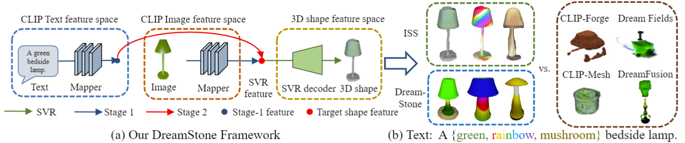

# [DreamStone](https://liuzhengzhe.github.io/DreamStone.github.io/) (TPAMI)
# ISS: Image as Stepping Stone for Text-Guided 3D Shape Generation (ICLR 2023 spotlight)


Code for the paper [ISS: Image as Stepping Stone for Text-Guided 3D Shape Generation](https://arxiv.org/abs/2209.04145) (ICLR 2023 spotlight) and [DreamStone: Image as Stepping Stone for Text-Guided 3D Shape Generation](https://arxiv.org/pdf/2303.15181) (TPAMI).


**Authors**: Zhengzhe Liu, Peng Dai, Ruihui Li, Xiaojuan Qi, Chi-Wing Fu




## Installation

```
conda env create -f environment.yaml
conda activate iss
python setup.py build_ext --inplace
```

## Data Preparation

* Download [Choy et. al. renderings](https://arxiv.org/abs/1604.00449)

```
wget https://s3.eu-central-1.amazonaws.com/avg-projects/differentiable_volumetric_rendering/data/ShapeNet.zip
```

* Download our [camera pose files](https://drive.google.com/file/d/1P8jCuFHxpN4jZSndwlYztxanSdDlY5It/view?usp=sharing)

Put the above two files to the same folder as "ISS-Image-as-Stepping-Stone-for-Text-Guided-3D-Shape-Generation"

##  Stage 1

(1) Pretrained Model

We provide pretrained models of stage 1 [here](https://drive.google.com/file/d/1hy2e-_4Ryn_xDfstmKpu7R0ad5U_GU_p/view?usp=sharing). 

(2) Training

```
cd stage1
python train.py configs/single_view_reconstruction/multi_view_supervision/ours_combined.yaml
```

##  Stage 2

Put the pretrained model of stage 1 to "stage2" folder. 

(1) Training

```
cd ../stage2
python train.py configs/single_view_reconstruction/multi_view_supervision/ours_combined.yaml --text 'a red car'
```

(2) Inference

```
python generate.py configs/demo/demo_combined.yaml --text 'a red car' --it 20
```

"it" means the iteration of saved model. 

Mesh and point cloud are saved in 'out/a red car/'

##  Stage3: texture stylization

[You can download our results](https://drive.google.com/drive/folders/1ackIt5IbruJa10W4Los8pJPQJ2gWdMqk?usp=sharing)

(1) First generate "a chair" in "stage2". 

(2) Training

```
cd ../stage3_texture
python train.py configs/single_view_reconstruction/multi_view_supervision/ours_combined.yaml --text 'wooden' --model '../stage2/out/a chair/model20.pt'
```

The rendered images are saved in "./tmp" folder. 

(3) Inference

```
python generate.py configs/demo/demo_combined.yaml --model 'out/single_view_reconstruction/multi_view_supervision/ours_combined/model.pt'
```

##  Stage3: shape-and-texture stylization

(1) First generate "a wooden boat" in "stage2". We may need more iterations to generate this shape, like "python train.py configs/single_view_reconstruction/multi_view_supervision/ours_combined.yaml --text 'a wooden boat' --iteration 30"

(2) Training

```
cd ../stage3_shape_texture
python train.py configs/single_view_reconstruction/multi_view_supervision/ours_combined.yaml --text 'tulip' --model '../stage2/out/a wooden boat/model20.pt'
```

The rendered images are saved in "./tmp" folder. 

(3) Inference

```
python generate.py configs/demo/demo_combined.yaml --model 'out/single_view_reconstruction/multi_view_supervision/ours_combined/model.pt'
```

##  Working with [GET3D](https://arxiv.org/abs/2209.11163)

See ``get3d_release'' folder.

##  DreamStone

See ``DreamStone'' folder.

## Acknowledgement

The code is built upon [DVR](https://github.com/autonomousvision/differentiable_volumetric_rendering) and [Stable-Dreamfusion] (https://github.com/ashawkey/stable-dreamfusion)

## Contact
If you have any questions or suggestions about this repo, please feel free to contact me (liuzhengzhelzz@gmail.com).
